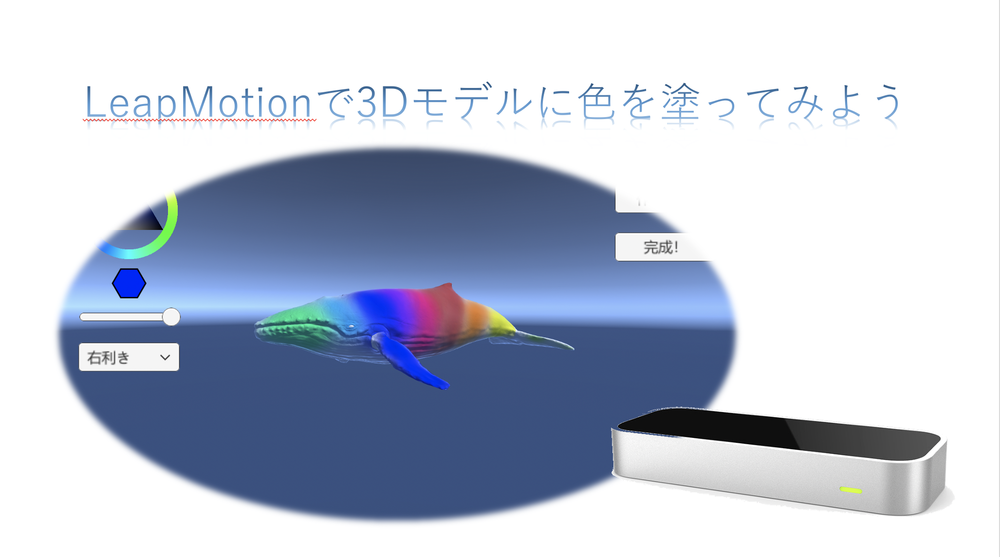

# Leap_painter

これはLeap motionを使ってクジラのモデルに色を塗るゲームです。
開発当時は管理できていなかったので、自分で書いたプログラムだけをアップロードしています。

## 開発環境と機材
- Unity
- Leap motion

## How to play
1. マウスで塗りたい色、利き手を設定します
2. Leap motionで利き手を認識してもらい、モデルに色を塗ります
	- 手をを握ると塗ることができます。塗りたくない時は開いておきましょう。
3. 塗れたら完了ボタンをクリック

## 参考画像

